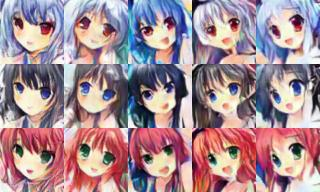

# Comics Generation
* Project link: [link](https://www.csie.ntu.edu.tw/~yvchen/f106-adl/A4)
* Requirement: Given eyes color and hair color, generate five corresponding images

## Dataset 
* Provided by ADLxMLDS2017. [Download link.](https://drive.google.com/drive/folders/1bXXeEzARYWsvUwbW3SA0meulCR3nIhDb)
* Each image has multiple tags, includes hair color and eyes color and other description.

## Pre-processing
1. Create a dictionary includes all kinds of hair colors and eyes colors. Every color corresponds to a number.
2. Read the tags file (.csv), and use the dict above to make a one-hot vector for each image. Now we only have tags that about hair color or eyes color.
3. Change the value range of original face images from [0,255] to [-1,1]

## Result
* I got the rank 2nd/170 in this course
* Generated images corresponding to blue hair red eyes, black hair blue eyes, red hair green eyes.

