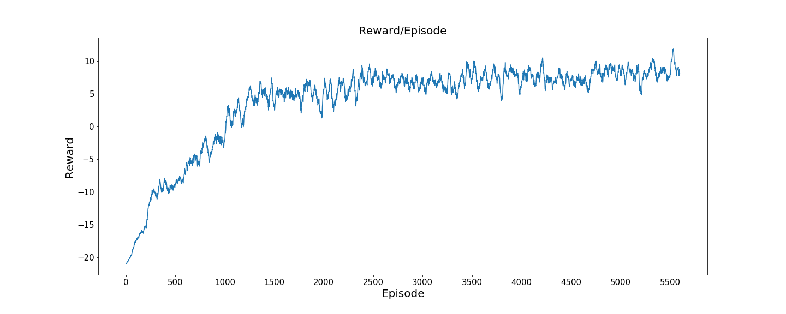
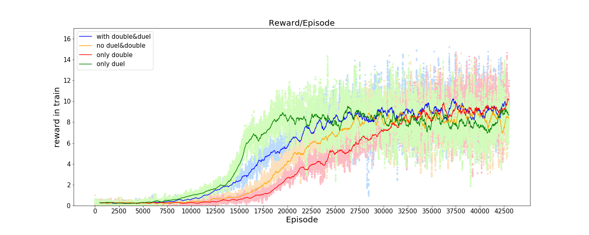

# Game Playing
* Project link: [link](https://www.csie.ntu.edu.tw/~yvchen/f106-adl/A3)
* Requirement: Use two kinds of reinforcement learning(RL) method to play [OpenAI](https://github.com/openai/gym) [Pong](https://gym.openai.com/envs/Pong-v0/) and [Breakout](https://gym.openai.com/envs/Breakout-v0/)

## Game Environment
* OpenAI Pong
* OpenAI Breakout

## Pre-processing
* Pong (Provided by ADLxMLSD2017 TAs)
1. Use previous frame minus current frame as observation
2. Transform from RGB format to gray-scale format
3. Resize to 80*80
4. Value range is [0, 255]

* Breakout (Provided by ADLxMLSD2017 TAs)
1. Transform from RGB format to gray-scale format, and resize each frame to 84*84 
2. Use Atari wrapper to wrap 4 frames
3. Value range is [0, 1]

## Result
### Train
* Moving Average of Policy Gradient(PG) plays Pong

* Moving Average of Deep Q Network(DQN) plays Breakout

### Test
* The average reward for playing 30 episode Pong games: 9.43
* The average reward for playing 100 episode Breakout games: 61.46