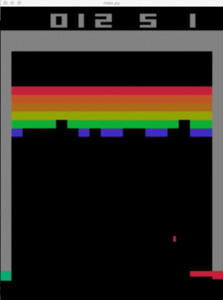

# ADLxMLDS 2017
Course [link](https://www.csie.ntu.edu.tw/~yvchen/f106-adl/index.html)

## Project Introduction (Details in the folders below)
### 1.Sequence Labeling
* Use **RNN** and **CNN** to predict phone sequence
* I got the rank 12th/191 in the [kaggle](https://www.kaggle.com/c/hw1-timit/leaderboard) competition

### 2.Video Caption
* Use **S2VT** and **attention method** to generate caption from video
* I got the rank 30th/189 in this course

### 3.Game Playing
* Use **PG** and **DQN** to play OpenAI gym games (Pong and Breakout)

### 4.Comics Generation
* Use **conditional GAN** to generate images from the given text (Text to Image)
* I got the rank 2nd/170 in this course
* Result

